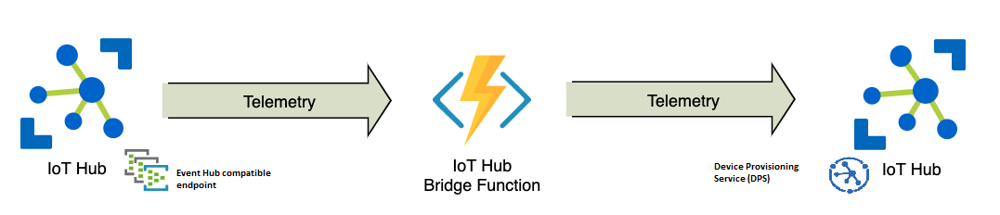
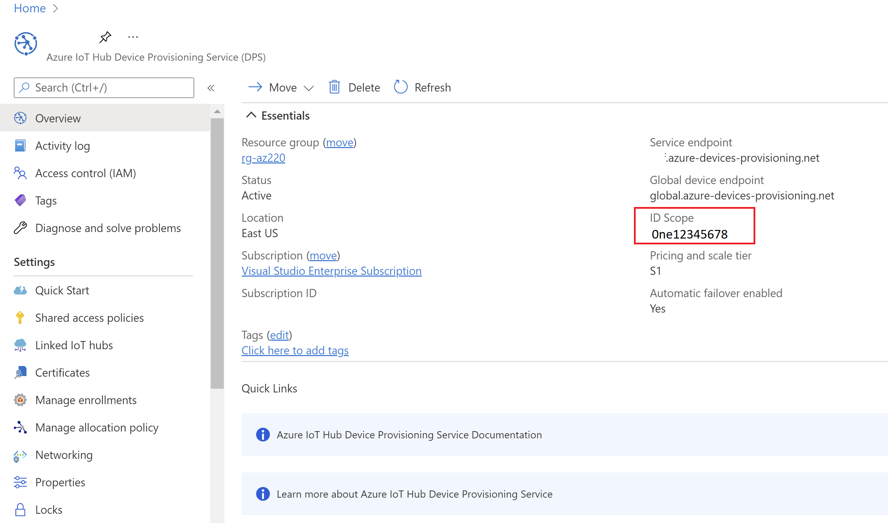
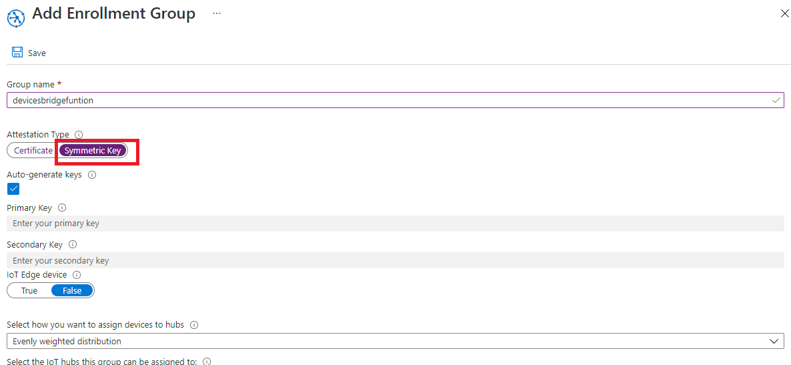
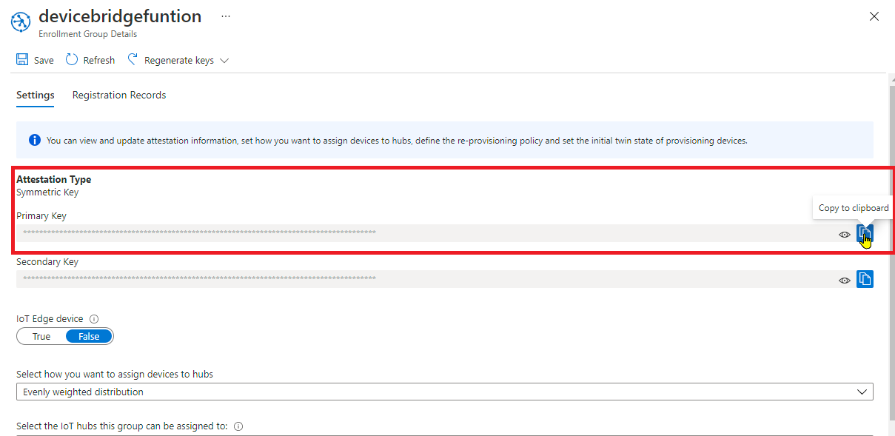

# iothub-bridge-function

This repo is based on [Azure IoT Central Device Bridge](https://github.com/Azure/iotc-device-bridge)

This repository contains everything you need to create an azure function that takes data from an IoT Hub and forwards it to other IoT Hub

## Instructions
Take the following steps to deploy an Azure Function into your subscription and set up the device bridge.

1. Click the `Deploy to Azure` button above. This opens up a custom ARM template in the Azure Portal to deploy the Azure Function.
2. Go to your `Target (IoTHub) DPS`.
  - Copy the `ID Scope` and paste it into the `Scope ID` field the custom template. 
4. Create a Enrollment Groups with `Settings > Manage enrollments`.
  - In the `Enrollment groups`, copy either the `Primary key` or the `Secondary key` and paste it into the `SAS Key` field. (this key will be stored in a Key Vault
provisioned with the function).
5. Go to `Source IoTHub` `Hub settings > Built-in endpoints`
  - Create a consumer group called 'azurefunciotc', you must create it in order to function can get messages from IoT hub
  - Copy `Event Hub compatible endpoint` and paste in the template in `Iot Hub Event Hub`

  
  
  
  
  
  
